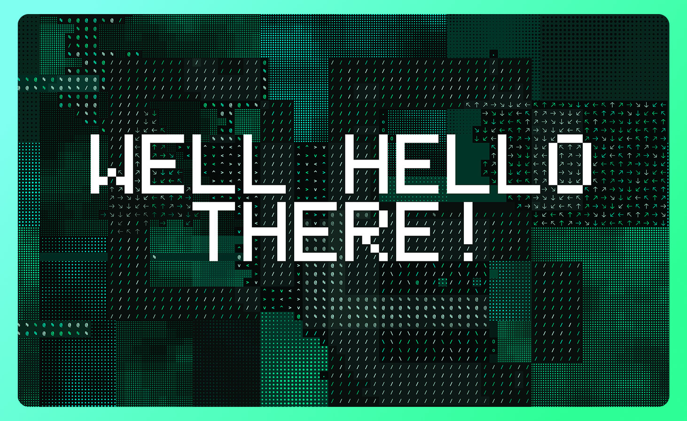
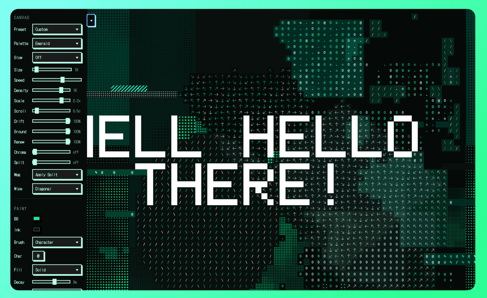

# ASCII Text Poster

A generative poster canvas built out of a grid of text cells. Halftone dot
fields, drifting blocks of glyphs, letterforms that assemble and rot, typed
messages, and a photo — or a clip, or your webcam — screened onto the grid as a
proper halftone. One self-contained HTML file, no build step.

Every composition has a seed, and the URL describes what you are looking at, so
anything you make can be kept or handed to someone else.

**[See it running →](https://petermarkellis.github.io/ascii_text_poster/)**





## Running it

Open `index.html` in a browser. That's the whole install. Or serve it:

```sh
npm start        # npx live-server . --port=8080
```

Serving gets you three things: a clean address bar via `history.replaceState`,
the modern clipboard API, and — the one that actually matters — **a secure
context, which the camera requires**. `localhost` counts; a page opened off
`file://` does not, and the button will tell you so.

The only external request is the DotGothic16 webfont, used for the panel. The
canvas stays on a monospace stack; the grid depends on uniform glyph metrics.

## Using it

**Drag on the canvas** to paint. **Drop an image or video anywhere** to screen it
onto the grid, or hit **Camera**. The panel collapses with the tab on its right
edge — it isn't an overlay, it's a block of canvas cells that builds and clears
with the same sweep as everything else.

Every control carries a `?` marker explaining what it does — hover, tap, or
reach it with the keyboard.

### Canvas

| | | |
|---|---|---|
| **Preset** | Poster · Storm · Minimal · Aberration | Sets seven sliders at once; drops to Custom when you move one. |
| **Palette** | Pop · Noir · Blanc · Emerald · Ember · Gold · Cobalt | Four dark, three light. Ink is picked against each cell's own ground, so every scheme stays legible. |
| **Glow** | Auto · On · Off | Blooms each glyph in its own ink. Auto follows the palette — only the neon schemes ask for it. |
| **Size** | 16–56 | Cell size in px. Reshapes the grid. |
| **Speed** | 0–200 | Scales the artwork clock. Transitions ignore it. |
| **Density** | 0–20 | How many drifting groups stay alive. |
| **Scale** | 0.5×–2.6× | How large those groups are built. |
| **Ground** | 0–100% | How much of the still layer is present. At `0` it dissolves in patches and leaves the canvas bare. |
| **Renew** | 0–100% | How fast the ground rewrites itself, one region at a time. Bars and painted cells are left alone. |
| **Scroll** | 0–100% | Marches the still layer sideways, up to 9 cells a second. Entities and the message stay put. |
| **Drift** | 0–100% | Scrolls the halftone dots without moving their cells. A screened photo is exempt. |
| **Chroma** | 0–100% | Left of centre gains red, right gains blue. |
| **Split** | 0–4 cells | Chromatic aberration: red from the left, blue from the right. Only edges fringe. |
| **Msg** | Ignore · Apply Split | Whether Split reaches the typed message. |
| **Wipe** | Random · Diagonal · Columns · Rows · Radial · Spiral · Noise | The front Regenerate travels along. |

### Paint

| | | |
|---|---|---|
| **BG / Ink** | colour | Reset per palette to a pair that reads against it. |
| **Brush** | Character · Arrow ↑→↓← · Ghost | The arrows and ghost are drawn SVG, so they stroke in the cell's ink. |
| **Char** | 1 character | Disabled while a drawn brush is selected. |
| **Fill** | Solid · Dots · Hatch | A dotted cell is a texture, never a character slot — dots suppress the glyph. |
| **Decay** | 0–5s | How long a stroke survives. `0` keeps it. Strokes only; the message has its own clock. |
| **Trail** | Auto · Darken · Lighten | A drag over ten cells cools behind the cursor. Auto sinks toward the palette's ground. |

### Message

**Inline** puts one letter per cell; **Large** builds each letter from a 5×7
block of cells that churn and fall away, so the word is revealed by subtraction.
**Loop** (`off`–8s) is how long it holds before fraying and playing again.

Text too wide for the grid wraps, and `//` breaks a line where you want:

```
HELLO // WORLD
```

The canvas opens on `WELL HEY THERE` in Large. Clearing the field gives an
explicit empty `msg=`, which round-trips back to a blank canvas.

### Source

Hidden until you load something. **Screen** is Dots (tone → dot radius, seven
levels) or Edges (a Sobel drawn with the four rule glyphs, so a picture comes
out as line art). **Motion** appears once the source moves — it differences
successive frames and spawns groups where the change is, so the canvas reacts to
you moving rather than to how bright you are.

Pause freezes the feed too, which is what lets you hold a frame and paint on it.
The camera is mirrored; a dropped clip isn't. If the camera is refused the button
says why.

### Buttons

**Pause** · **Regenerate** (new seed) · **Load Media** · **Camera** · **Share
Link**. Everything except Regenerate keeps the seed, so changing the palette or
cell size shows you the *same composition* differently.

## Sharing

The hash carries the seed and every control, omitting defaults — so a bare share
is just `#seed=8412`. One consequence: changing a default changes how every link
that omitted it renders.

```
#seed=7777&palette=emerald&size=34&chroma=55&split=2&msg=HI+//+THERE
```

It's read on every change, not just at load, so you can edit it in the address
bar and the canvas follows. Deleting a parameter resets its control.

Parameters: `seed`, `palette`, `size`, `speed`, `density`, `scale`, `chroma`,
`scroll`, `drift`, `ground`, `renew`, `split`, `decay`, `trail`, `wipe`,
`msgsplit`, `loop`, `glow`, `screen`, `motion`, `fmt`, `msg`. A source can't
ride along — it stays local to the tab.

## How it works

The code is commented in depth; this is the shape of it.

- **Two layers.** `base` is the still poster and never animates; `entities` are
  the drifting groups composited over it each frame. Keeping them apart is what
  lets a group move away and reveal what was underneath.
- **Seeded throughout.** Every scattered decision draws from one mulberry32
  stream, so a seed plus a grid size reproduces a poster exactly. That's what
  makes a composition shareable: the URL carries the number, not the picture.
- **Halftones are real `<pattern>` fills**, serialised to data-URIs so each cell
  carries its own dot colour while still tiling as one continuous field.
- **One mask contract.** A shape is `(lx, ly, w, h) => bool` and `FONT` is a 5×7
  bitmap, so a letter assembles, softens at its rim and rots exactly as a
  triangle does — none of that code knows the difference.
- **The dissolve is noise plus a ramp**, so groups materialise from the leading
  edge and rot from the trailing one in ragged patches rather than a clean wipe.
- **Transitions are one function**: where a cell sits in the front's order of
  arrival, 0..1. Swap it and you swap the transition.
- **Palettes fill identical slots**, so the composition logic never changes —
  only the values. Every reachable ink-and-ground pair clears 1.6:1.
- **Rendering is a frame diff.** Cell state lives in parallel arrays and only
  changed properties are written to the DOM, so cost tracks the cells that
  actually moved. The ticker runs at a fixed 18 fps.

## Hosting

The site is the repository — one HTML file, one image, no build step — so GitHub
Pages serves it straight from `main`. `.nojekyll` keeps the tree verbatim.

Moving it means updating four strings in the `<head>` (`og:url`, `canonical`,
`og:image`, `twitter:image`) plus `url` and `image` in the JSON-LD.

## Credits

By [Peter Ellis](https://x.com/pellisdesign).

## Licence

Not yet specified.
